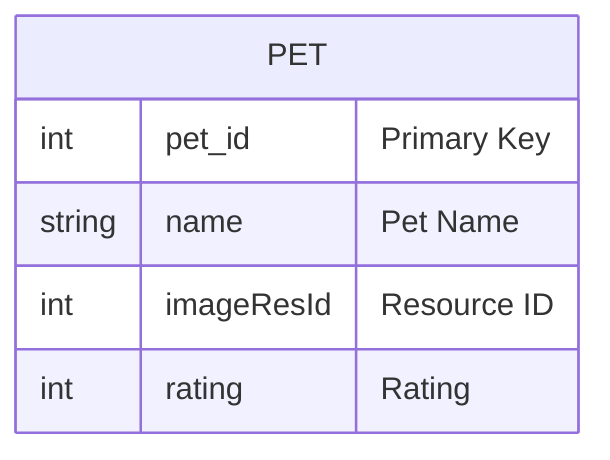

# Coursera: Programa especializado: Desarrollo de aplicaciones móviles con Android

## Curso 3 - Module 8

Tomando como punto de partida la funcionalidad que generaste para mostrar las ultimas 5 mascotas, es momento de dar persistencia a esta información.

Estas 5 mascotas estarán cambiando conforme el usuario da rating a una o varias, mascotas. En el POJO que estas manejando para la entidad mascota genera un identificador el cuál deberá ser único y te permita diferenciar una mascota de otra.

Crea un modelo de base de datos que contenga una tabla llamada mascota esta debe ser idéntica al POJO de mascota, de tal forma que cuando una persona de rating a una foto puedas guardar los datos completos de la entidad en la base de datos. Para fines de este ejercicio tu tabla solo estará guardando las últimas 5 mascotas con rating.

## Evidencias:
1. Aplicación corriendo.
   
[Course3.Module8.webm](https://github.com/user-attachments/assets/42285bd2-34cb-4bab-a2d6-980048e11d20)

2. **Modelo**: Al ser un ejemplo simple, la única entidad que se pide es la de Mascotas.
   

3. **Base de datos**: Se utilizó Room en vez de SQLiteOpenHelper, además de otras clases necesarias.

||  |
| - | - |

|  |  |
| - | - |

## Notas
1. La función de aumentar rating o favoritos se actualiza solo al regresar otra vez a la pantalla de lista de todas las mascotas. Para efectos de simplicidad se dejo asi.
2. Se mantuvo lo mas simple posible para no agregar mas librerias como RXjava para este entregable, a excepción de usar Room que simplifica mucho las cosas. Para ejecutar las operaciones de base de datos se uso ExecutorService.
3. Para la pantalla de Perfil de Mascota aun se mantiene el código hardcodeado de la clase PetDataset, ya que las instrucciones no lo especifica.
4. Para probar se debe desinstalar y volver a instalar.
5. Version de Android Studio: Android Studio Narwhal | 2025.1.1
